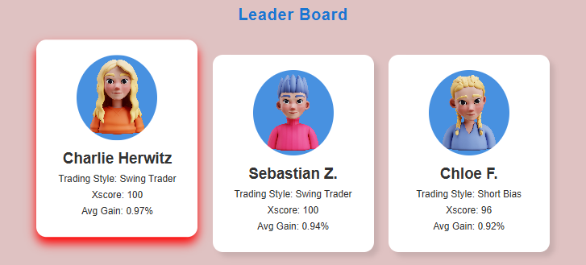
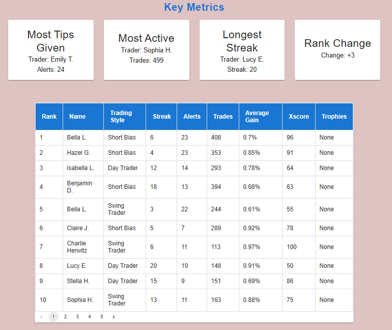

Leaderboard Interface

This project is a Leaderboard Interface built with React and Material-UI. It dynamically fetches and displays trader data in a visually appealing and responsive manner.

🌟 Features

Top Traders:
Displays the top 3 traders with their trading style, Xscores, and average gains.

Key Metrics:
Highlights important metrics such as:

Most Tips Given

Most Active Traders

Longest Streaks

Rank Changes

Leaderboard Table:
A paginated table listing all traders with details like:

Rank

Name

Trading Style

Alerts

Trades

Average Gain

Xscores

Trophies

Responsive Design:
Fully optimized for desktops, tablets, and mobile devices.

🚀 Installation and Setup

To run this project locally, follow these steps:

Prerequisites

Node.js and npm installed on your machine. You can download them here.

Steps

Clone this repository:

git clone https://github.com/<your-github-username>/<repository-name>.git

Navigate to the project folder:

cd <repository-name>

Install the required dependencies:

npm install

Start the development server:

npm start

Open http://localhost:3000 in your browser to view the application.

📂 Folder Structure

.
├── src
│   ├── components       # React components (TopTraders, KeyMetrics, LeaderboardTable)
│   ├── api              # API logic for fetching trader data
│   ├── App.js           # Main application file
│   ├── index.js         # React entry point
├── public               # Static assets like images and index.html
├── package.json         # Project dependencies and scripts

📸 Screenshots

Leader Board Section

Key Metrics Section

🛠️ Built With

React: Frontend library for building user interfaces

Material-UI: Component library for consistent and responsive design

JavaScript: Programming language for interactivity

📝 License

This project is licensed under the MIT License. See the LICENSE file for details.

